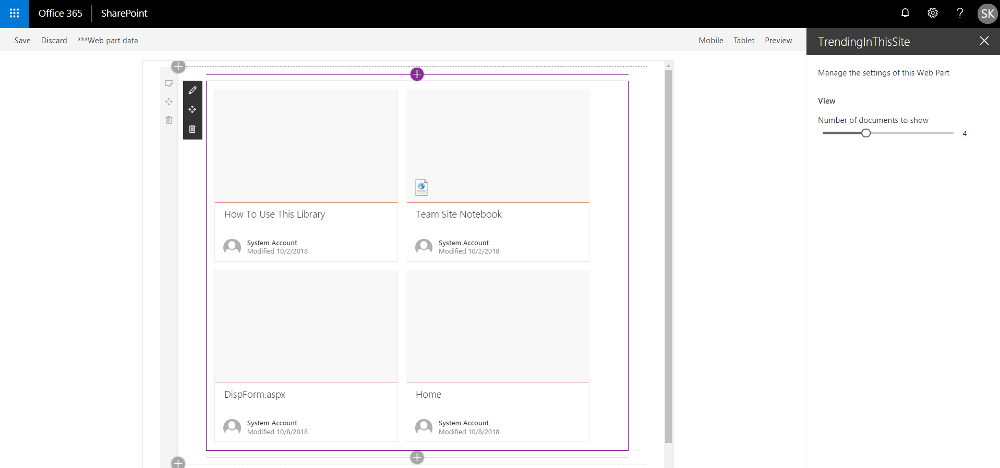

# SharePoint Framework (SPFx) Trending in this site Web Part (demo3)

Sample SharePoint Framework Client-Side Web Part built using React showing documents trending in the current site.

## Running this Web Part

- clone this repo
- `$ npm i`
- `$ gulp serve --nobrowser`
- create a copy of the **./temp/workbench.html** file and change its extension to **.aspx**
- in the contents of the **workbench.aspx** file change the URL of the **webAbsoluteUrl** property to the URL of your site, eg. `https://contoso.sharepoint.com/sites/my-team`
- upload the **workbench.aspx** file to the Document Library in your site
- navigate to the workbench page uploaded to your SharePoint site, ie. _https://contoso.sharepoint.com/sites/my-team/documents/workbench.aspx_

## Features
The _Trending in this site_ Client-Side Web Part is built on the SharePoint Framework using React and uses the [Office UI Fabric React](https://github.com/OfficeDev/office-ui-fabric-react) for showing document cards.

This Web Part illustrates the following concepts on top of the SharePoint Framework:

- using React for building SharePoint Framework Client-Side Web Parts
- using Office UI Fabric React components for building user experience consistent with SharePoint and Office
- communicating with SharePoint using its REST API
- communicating with the Office Graph via the SharePoint Search REST API
- passing Web Part properties to React components
- using ES6 Promises with vanilla-JavaScript web requests