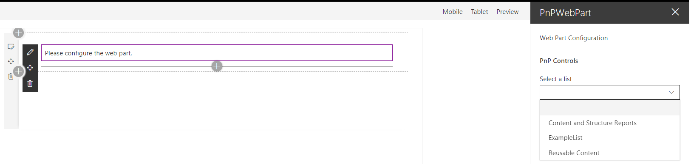
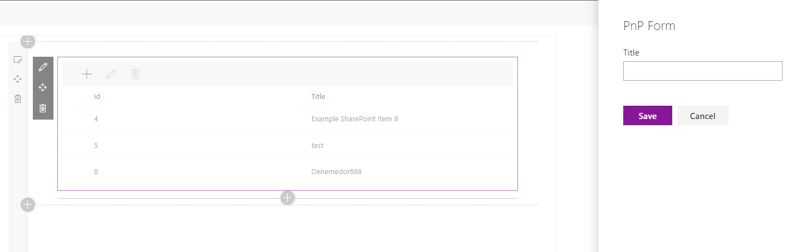
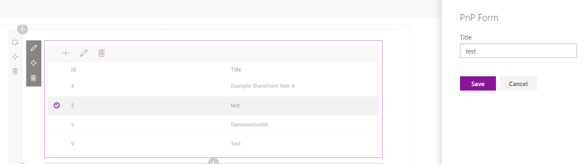
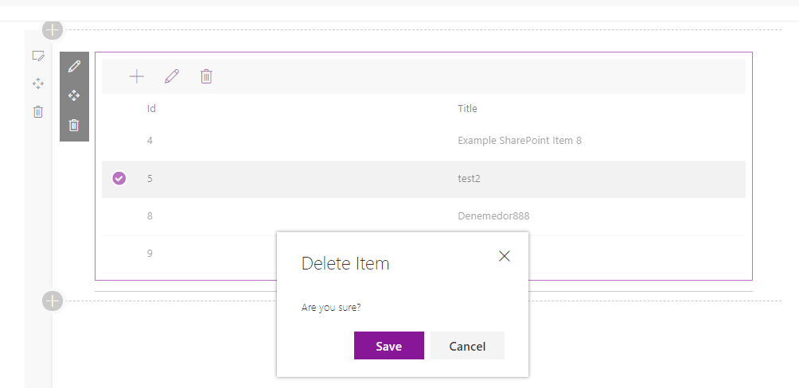

# SharePoint Framework (SPFx) PnP Example Web Part (demo4)

Sample SharePoint Framework Client-Side Web Part built using React create, edit and delete item in list.

## Running this Web Part

- clone this repo
- `$ npm i`
- `$ gulp serve --nobrowser`

## Features
React and uses the [Office UI Fabric React](https://github.com/OfficeDev/office-ui-fabric-react).

This Web Part illustrates the following concepts on top of the SharePoint Framework:

- using React for building SharePoint Framework Client-Side Web Parts
- using Office UI Fabric React components for building user experience consistent with SharePoint and Office
- communicating with SharePoint using its PnP