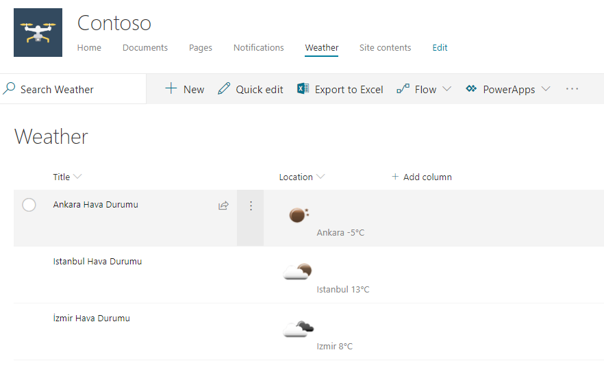

# SPFx Weather Field Customizer

## Summary
Sample SharePoint Framework field customizer extension that shows weather from a location field.



## Applies to

* [SharePoint Framework Extensions](https://dev.office.com/sharepoint/docs/spfx/extensions/overview-extensions)

---

## Minimal path to awesome

- Clone this repository
- Update the `pageUrl` properties in the **config/serve.json** file
  - The `pageUrl` should be a modern page
  - This property is only used during development in conjunction with the `gulp serve` command
- In the command run:
  - `npm install`
  - `gulp serve`
- In a web browser
  - Follow one of the steps below for **List Deployment**
    - Add some sample list items
  - Choose **Load Debug Scripts** when prompted

## Features
This extension illustrates the following concepts:

- Separating logic into a static service
- Adapting **Office UI Fabric styles**
- Promise chaining with Exception bubbling
- Theme syntax for applying official colors to custom CSS classes

## List deployment

This solution expects the site to contain a **Weather** list. Here are 2 options to ensure this list exists:

### Option 1: Use the included PnP provisioning template

A PnP Remote Provisioning template has been provided ([WeatherList.xml](./assets/WeatherList.xml)) along with a PowerShell script to apply the template to your site ([ApplyTemplate.ps1](./assets/ApplyTemplate.ps1)). This is by far the easiest way to get the list on a site but requires some minor setup.

> You can also use this template as part of a [Site Design](https://docs.microsoft.com/en-us/sharepoint/dev/declarative-customization/site-design-pnp-provisioning).

#### Prerequisites

You'll need the [SharePoint PnP PowerShell Cmdlets for SharePoint Online](https://github.com/SharePoint/PnP-PowerShell). It's a very quick install and if you don't have it already, go get it! You'll end up using it for far more than just this sample.

#### Running the PowerShell script

Using a PowerShell console (you can even use the powershell terminal included in Visual Studio Code), navigate to the assets folder in this sample. Run the script like this:

```PowerShell
.\ApplyTemplate.ps1 https://yourtenant.sharepoint.com/sites/yoursite WeatherList.xml
```

You'll be prompted for your credentials and then the list will be created. The only thing included in the template is the Toast list. You may receive a warning about the site template not matching but this can be safely ignored since the custom list definition is supported everywhere.

> Read More Here: [Introducing the PnP Provisioning Engine](https://github.com/SharePoint/PnP-Guidance/blob/551b9f6a66cf94058ba5497e310d519647afb20c/articles/Introducing-the-PnP-Provisioning-Engine.md)

### Option 2: Manually create the list

You can always manually create the list using the SharePoint UI:

1. Navigate to the Site Contents page and choose **New** > **List**
2. Name the list _**Weather**_ and click **Create**
3. Add and configure the columns as listed below:

Column | Type | Required | Details
--- | --- | --- | ---
Title | Text | Yes |
Location | Choice | Yes | "Istanbul,tr", "Ankara,tr", "Izmir,tr"

#### Prerequisites

You'll need the [SharePoint PnP PowerShell Cmdlets for SharePoint Online](https://github.com/SharePoint/PnP-PowerShell). It's a very quick install and if you don't have it already, go get it! You'll end up using it for far more than just this sample.

